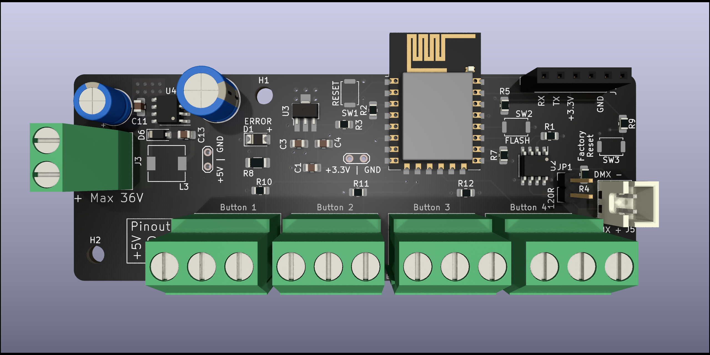
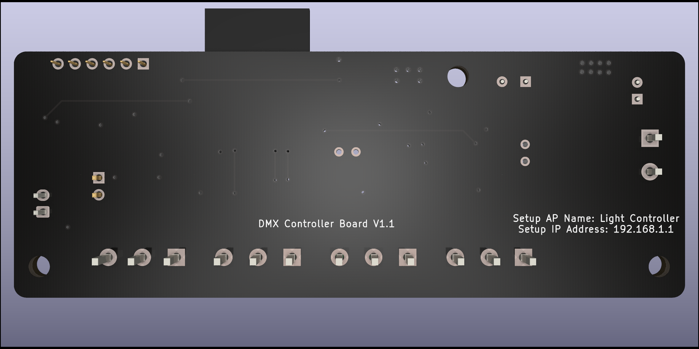
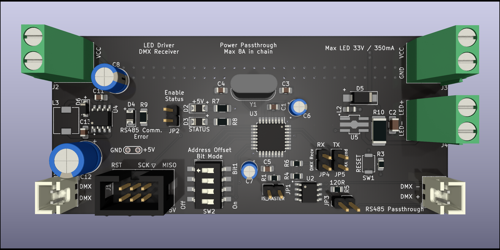

# DMX512 Controller with remote LED drivers
This is a wireless DMX512 controller that will accept input of channel data via MQTT or manual control of a channel via button input. It has built in support for MQTT auto-registration in Home Assistant. The controller can take up to four inputs for buttons that can control 4 channels of DMX data. Each LED Driver board is configured to drive 350mA LEDs and each LED Driver board can be confiued for a channel separately.

## Images
### Controller board

### LED Driver board

## Bugs
* Input for Button 3 does not work. This needs a redesign of the PCB and for it to use an other GPIO input.