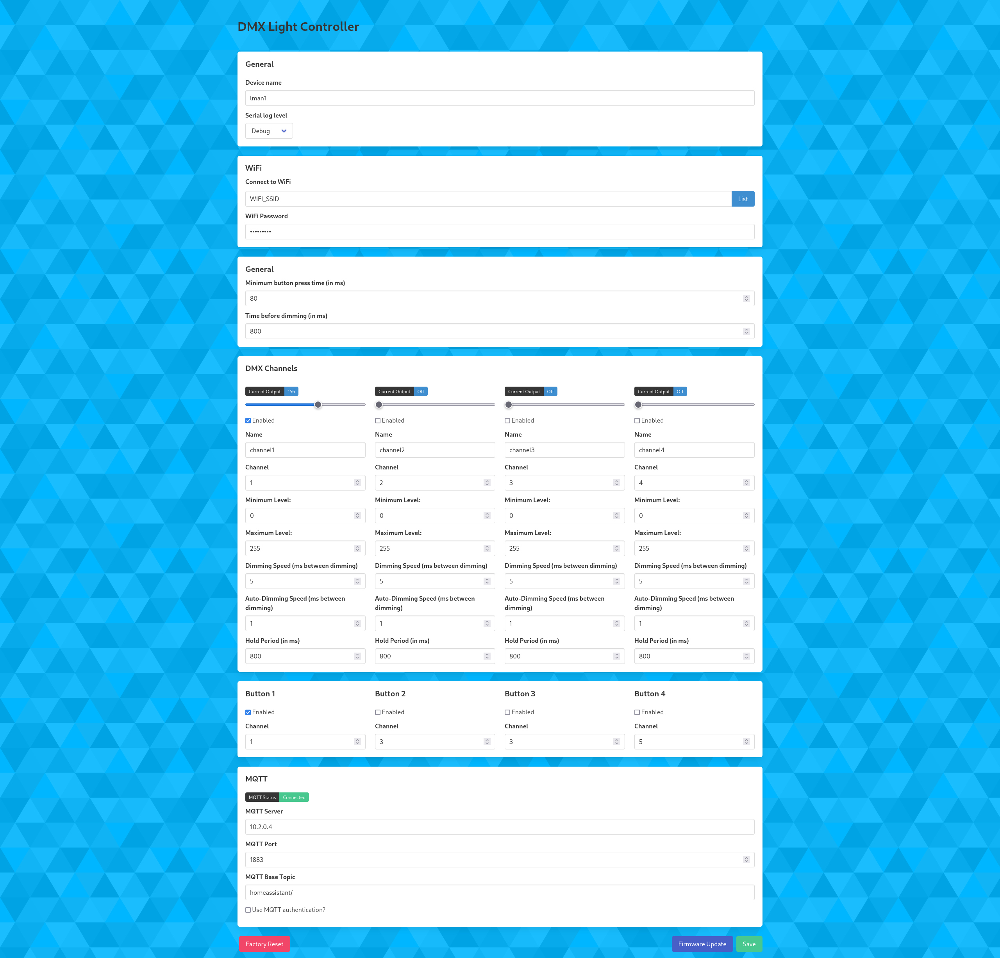
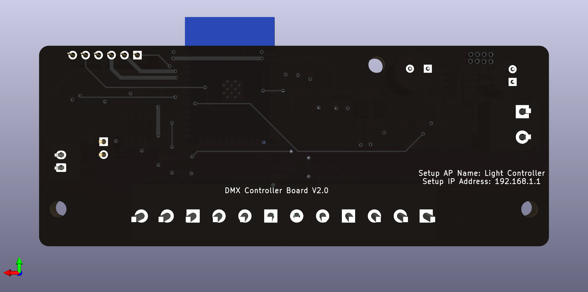

# DMX512 Controller with remote LED drivers
This is a wireless DMX512 controller that will accept input of channel data via MQTT, web interface or manual control of a channel via button input. It has built in support for MQTT auto-registration in Home Assistant. The controller can take up to four inputs for buttons that can control 4 channels of DMX data. Each LED Driver board is configured to drive 350mA LEDs and each LED Driver board can be configured for a channel separately.

# Features
* Auto-registration of channels to Home Assistant via MQTT.
* Setup AP to configure parameters to connect to WiFi.
* Web interface to dynamically configured all settings without changing the code.
* Multiple buttons can control the same channel.
* Many settings for controlling dimming behaviour.
* Control of up to 4 different channels of lights.

# Settings
|Setting|Description|
|--------|-----------|
|Device name|Used as WiFi hostname, MQTT client name and as "device name" in Home Assistant.|
|Serial log level|The desired log level for serial output. Simply leave at "Error" or "None" when installed as no serial monitor will be there to capture it.|
|Connect to WiFi|The WiFi SSID (WiFi name) to connect to. Bu pressing the "List"-button a list of all available networks can be shown and a network selected.|
|WiFi Password|The password (PSK) for the chosen WiFi.|
|Minimum button press time|The time, in milliseconds, a button must have the same state before it is considered a press.|
|Time before dimming|The maximum time for a button to be considered a "press". If the button is still held after this amount if time the channel will start dimming.|

## Channel Settings
|Setting|Description|
|--------|-----------|
|Slider|The slider can be used to control brightness directly from the web interface.|
|Enabled|Wether the channel is in use or not.|
|Name|This is used as the light name in Home Assistant.|
|Channel|The DMX channel to send data on. This must match the "slave" card that is connected to the actual LEDs.|
|Minimum Level|Many LEDs simply don't light below to low a voltage. This setting will force at least the light level as the minimum. By using the slider for the channel and noting the value in "Current Output" this value can be found quiet easily.|
|Maximum Level|The maximum light level.|
|Dimming Speed|The time, in milliseconds, between each step up/down when dimming via a button input.|
|Auto-Dimming Speed|The time, in milliseconds, between each step up/down when dimming via web interface or MQTT.|
|Hold Period|The time, in milliseconds, to wait at min/max positions before switching direction and dimming again.|

## Button Settings
|Setting|Description|
|--------|-----------|
|Enabled|Used to enabling checking of button input.|
|Channel|This must match a configured channel in the "DMX Channels"-section. This is the DMX-channel to control.|

## MQTT Settings
|Setting|Description|
|--------|-----------|
|MQTT Server|The address to the MQTT server to be used.|
|MQTT Port|The port of the MQTT server.|
|MQTT Base Topic|The configured MQTT topic for Home Assistant to listen on. The default in Home Assistant is "homeassistant/".|
|Used MQTT authenticaion?|Check if using username and password for authentication to MQTT server.|
|MQTT Username|The username to use for login at the MQTT server.|
|MQTT Password|The password to use for login at the MQTT server.|

## Images
### Web Interface

### Controller board

### LED Driver board

## Bugs
* Input for Button 3 does not work. This needs a redesign of the PCB and for it to use an other GPIO input.